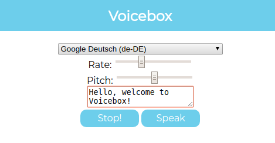

# Voicebox
Speech synthesis application using the Web Speech API. Type in anything you want in the text box and click "Speak" to hear it played back to you. You can also move the sliders to change the speed and pitch.

**Link to project:** https://tariqnaziri.github.io/voicebox/

## How It's Made:

**Tech used:** HTML, CSS, JavaScript ES6+,

I create a new Speech Synthesis object, and use its built in methods to give it functionality. I created functions that took all of the voices that are available in the browser and add them to an array, map all of the indexes of the array to a drop down menu, be able to actually set the voice you want to use, and also I created event listeners that would stop and start speech, and prevent voices from over lapping if there are changed mid sentence.
