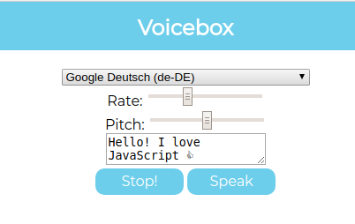

# My Awesome Project
A fun little project I made where I am experimenting with speech synthesis using the Web Speech API. Type in anything you want in the text box and click the speak button to hear it.

**Link to project:** http://recruiters-love-seeing-live-demos.com/

## How It's Made:

**Tech used:** HTML, CSS, JavaScript ES6+,

This was a simple and fun project to make, that ended being not as hard to pull off than I thought it would. Basically I create a new Speech Synthesis object, and use its built in methods to give it functionality. I created functions that took all of the voices that are available in the browser and add them to an array, map all of the indexes of the array to a drop down menu, be able to actually set the voice you want to use, and also I created event listeners that would stop and start speech, and prevent voices from over lapping if there are changed mid sentence.
